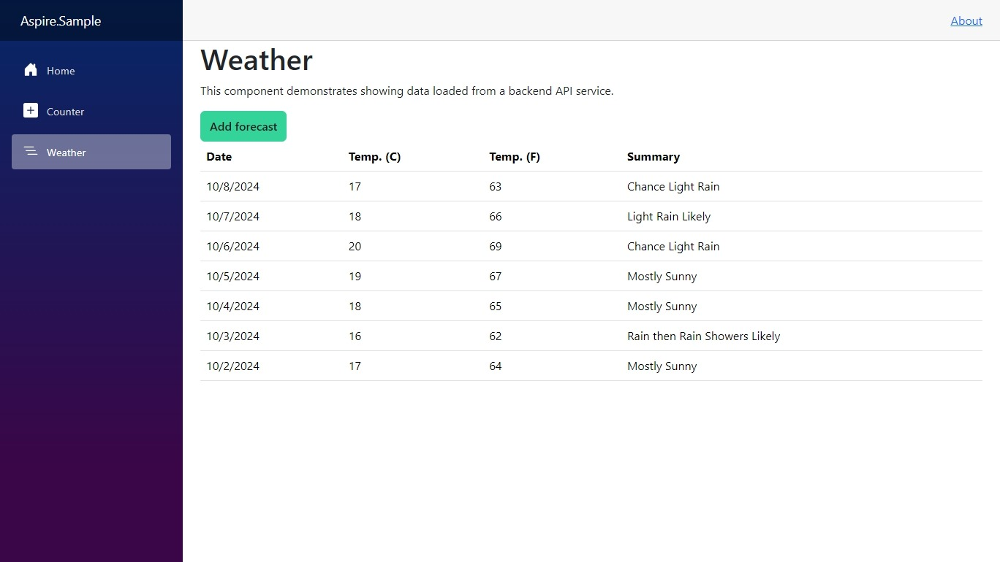

# .NET Aspire Extended Sample

The project extends the standard .NET Aspire sample with some key additions:

* Retrieves actual forecasts from the National Weather Service
* Stores forecasts in a database, and handles migration
* Uses Vue.JS for web UI
* Generates TypeScript backend API

## Architecture


## Prerequisites

* [.NET 8.0](https://dotnet.microsoft.com/download/dotnet/8.0)
* [.NET Aspire Workload](https://learn.microsoft.com/en-us/dotnet/aspire/fundamentals/setup-tooling)
* [Docker Desktop](https://www.docker.com/products/docker-desktop) installed and running

## Getting Started

The sample is configured and ready to go out of the box. In a terminal window:

```dotnetcli
dotnet run --project .\Aspire.Sample.AppHost\

info: Aspire.Hosting.DistributedApplication[0]
      Login to the dashboard at https://localhost:17193/login?t=redacted
```

Then open the dashboard URL in a browser window, as described in the logs.


Click on the Endpoint listed under the `vue` resource. Then click on "Weather" to see the sample in action:


